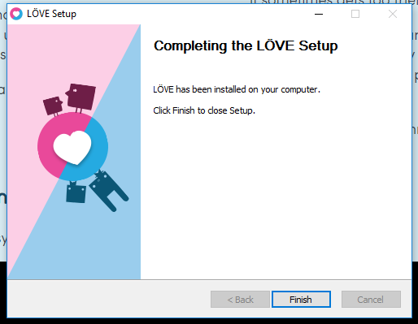

# Games met Lua en Löve2D {first-page}
## Installatie instructies {first-page}

<br /><br /><br /><br />
<div style="text-align: center;">
  
</div>

<div class="pagebreak"></div>

# 1. Introductie
In deze handleiding lopen we samen door alle stappen die nodig zijn om de juiste hulpmiddelen te installeren en zo snel mogelijk aan de slag te kunnen met het bouwen van games met Lua en Löve2D. Aan het eind van deze handleiding hebben we Löve2D en Atom geinstalleerd.

<div style="clear: both;">
  
  <p>Love2D is een 2D game framework waar je eenvoudig 2D games mee kunt bouwen. Het handige van Love2D is dat er al een heleboel handigheidjes in zitten, het is gratis en bovendien werkt het onder meer op Windows, Mac en Linux.</p>
</div>

<br />

<div style="clear: both;">
  
  <p>Lua is een programmeertaal die vaak wordt gebruikt voor het bouwen van games en lijkt qua syntax op andere talen zoals Python, Ruby en JavaScript.<p>
</div>

<br />

<div style="clear: both;">
  
  <p>Atom is een tekst editor, volledig gratis en te configureren zoals jij dat wilt! Bovendien beschikbaar voor Windows, Mac en Linux</p>
</div>

<div style="clear: both;"></div>
<br />

De instructies voor installatie op Windows bevinden zich in hoofdstuk 2, de instructies voor macOS in hoofdstuk 3.

<div class="pagebreak"></div>

# 2. Windows
In dit hoofdstuk behandelen we de installatie van het Löve2D framework en de Atom editor op Windows. Kijk voor instructies voor macOS in hoofdstuk 3. Deze instructies zijn gebaseerd op Windows 10 maar wijken voor andere versies niet veel af.

## 2.1 Löve2D

<span class="bold underline">Stap 1: Downloaden van Löve2D</span>
Ga naar de Löve2D website op <span class="green">http://love2d.org</span> en kies vervolgens in de linker kolom (Windows XP+) voor 32-bit installer of 64-bit installer. Dit is afhankelijk van de Windows versie die je gebruikt.


<span class="bold underline">Stap 2: Installatie starten</span>
Zodra het downloaden klaar is kun je de installatie starten door onderaan je browser op `Run` te klikken, dit kan er in verschillende browsers anders uitzien, maar de werking is hetzelfde.


<div class="pagebreak"></div>

Het kan voorkomen dat Windows nog om bevestiging vraagt voordat je door kunt gaan. Hier kun je gewoon voor `Yes` kiezen om verder te gaan met de installatie. Mocht dit scherm niet naar voren komen dan zal de installatie automatisch starten.
<br />
<div class="center">
  
</div >

<div class="pagebreak"></div>
De installatie zal nu starten en het volgende scherm tonen:
<div class="center"></div >

Voor de standaard installatie kun je gewoon op `Next` blijven klikken tot je bij het volgende scherm komt:
<div class="center"></div >

Dit was de laatste stap. Door op `Finish` te klikken sluit je de installatie af en kun je door gaan met de volgende stap.

<div class="pagebreak"></div>
<span class="bold underline">Stap 3: Testen of het gelukt is!</span>

Deze stap is vrij eenvoudig; start Löve2D op. Als alles goed is gegaan zou je het volgende scherm te zien moeten krijgen:


Dit scherm vertelt dat Löve2D goed is geinstalleerd maar dat we nog geen game hebben ingeladen.

<div class="pagebreak"></div>

## 2.2 Atom
Om nu daadwerkelijk games te kunnen gaan bouwen hebben we een tekst editor nodig. In deze handleiding gaan we uit van Atom. Dit is een gratis tekst editor van GitHub en te downloaden op <span class="green">http://atom.io</span>.


Eenmaal op atom.io, klik dan op `Download Windows Installer` en wacht je tot het downloaden (+/- 100MB) voltooid is.


Als het downloaden voltooid is, kies dan, net als bij Löve2D, voor `Run`. De installatie zal vervolgens gestart worden.
In tegenstelling tot Löve2D zal de installatie direct beginnen zonder dat je eerst een wizard moet doorlopen. De installatie kan eventjes duren en ziet er als volgt uit:
<div class="center"></div>

Als de installatie voltooid is start Atom automatisch op, dit ziet zo uit:


Dat was alles! Nu kun je aan de slag met het bouwen van leuke games met Lua en Löve2D!


<div class="pagebreak"></div>

# 3. macOS
In dit hoofdstuk installeren we Löve2D en Atom op macOS. Kijk voor de installatie instructies op Windows in hoofdstuk 2.

## 3.1 Löve2D
<span class="bold underline">Stap 1: Downloaden van Löve2D</span>
De eerste stap is het downloaden van Löve2D. Ga hiervoor naar de download pagina op <span class="green">http://love2d.org</span> en kies voor '64-bit zipped' onder Mac OS X 10.7+.


<div class="pagebreak"></div>

<span class="bold underline">Stap 2: Installeren van Löve2D</span>
De gedownloade versie staat nu in de downloads folder, sleep `love.app` naar de Applications folder of op je Desktop zodat je er eenvoudig bij kunt.


<div class="pagebreak"></div>

<span class="bold underline">Stap 3: Testen of het gelukt is!</span>
Om te testen of het gelukt is en of alles werkt hoef je `love.app` alleen maar te starten. Als alles goed is gegaan zal onderstaand scherm verschijnen:


<div class="pagebreak"></div>

## 3.2 Atom
<span class="bold underline">Stap 1: Downloaden van Atom</span>
Om nu daadwerkelijk games te kunnen gaan bouwen hebben we een source code editor nodig. In deze handleiding gaan we uit van Atom, deze gratis source code editor van GitHub is te downloaden op <span class="green">http://atom.io</span>.


Eenmaal op atom.io, klik dan op `Download For Mac` en wacht je tot het downloaden (+/- 100MB) voltooid is.

<span class="bold underline">Stap 2: Installeren van Atom</span>
Als het downloaden voltooid is, sleep `atom.app` dan naar de Applications folder. Het installeren van Atom is daarmee voltooid en Atom kan worden gestart.


<div class="pagebreak"></div>

# 4. Aan de slag
Nu we alles hebben geinstalleerd kunnen we echt aan de slag! In dit hoofdstuk laten we zien hoe je begint met het maken van een game en hoe je deze opstart!

## 4.1  Nieuwe game maken
1. Maak een nieuwe map en geef deze de naam van jouw game, bijvoorbeeld `coderdojo-game`
2. Open het mapje `coderdojo-game` in de Atom editor
3. Maak in deze map een nieuw bestand en noem deze `main.lua`
4. Maak in `main.lua` drie nieuwe functies:

```lua
function love.load()
end

function love.draw()
end

function love.update()
end
```
Dit zijn de basis bouwstenen voor het maken van een game met Löve2D en Lua! Lees verder in hoofdstuk 4.2 hoe je jouw game start en hoe je foutjes in de code kunt ontdekken!
<div class="pagebreak"></div>

## 4.2 Game starten & fouten ontdekken
Het starten van een game in Löve2D is erg eenvoudig. Zoek de applicatie `löve` die we in hoofdstuk 2 hebben geinstalleerd en hou het mapje met daarin `main.lua` bij de hand. Om de game te starten sleep het het mapje op het Löve2D icoon.
<div class="center"></div>

Als alles goed is gegaan opent er een leeg zwart scherm. Het scherm zal leeg blijven omdat de functies ook nog leeg zijn.

<div class="center"></div>
<!---->

Tijdens het programmeren is een tikfoutje zo gemaakt, een vergeten punt, een haakje verkeerd of een comma vergeten en je programma werkt niet! Zo ook in lua. Maar gelukkig vertelt Löve2D precies wat er aan de hand is! Als je een foutje hebt gemaakt, dan ziet dat er ongeveer als volgt uit:

<div class="center"></div>
<!---->


<div class="pagebreak"></div>

# Colofon

Dit document is geschreven door Tiemen Waterreus voor CoderDojo Rotterdam (SF). Mocht je na het lezen van dit document vragen of opmerkingen hebben dan zijn die utieraard welkom via <span class="green">contact@coderdojo-rotterdam.nl</span>!